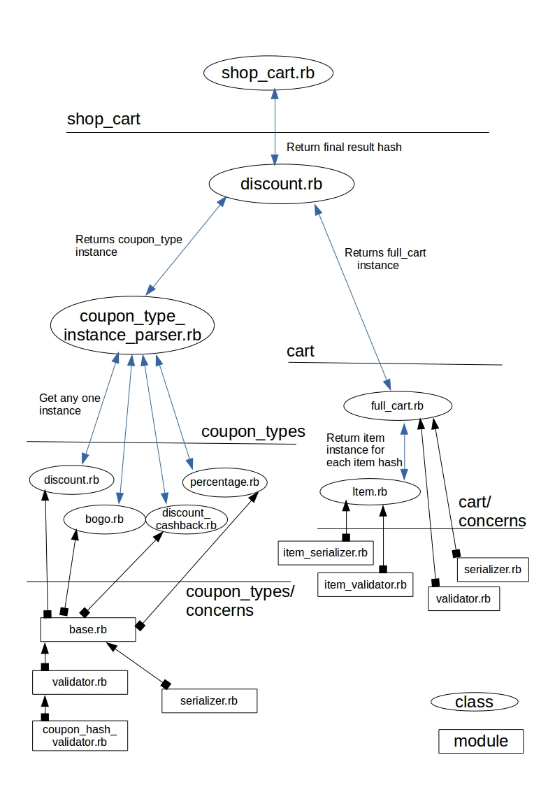

# Shop Cart
<b>Requirements</b> 
ruby 2.3
 
 
<b>Run Application</b>
<ul>
  <li>bundle install (Gems used: faraday, rake)</li>
  <li>Run <b>ruby lib/shop_cart.rb</b></li>
  <small> **Go to the root of project folder and run this command, it will auto download the coupon_codes.json file using a rake task [json:coupon_codes], this task can be run again from the app root folder to re-download the file</small>
  <small> **json/cart_items.json is the application input file, modify accordingly</small>
</ul>
 
 
<b>Application Structure</b>
<ul>
  <li>
    <b>config</b> - Contains all the configuration, constants, errors classes
    <ul>
      <li><i>constants.rb</i> - Constant Strings used throughout the application.</li>
      <li><i>errors.rb</i> - Errors String used while raising an exceeption.</li>
    </ul>
  </li>
  <li>
    <b>json</b> - Contains all the static jsons used by the application
    <ul>
      <li><i>cart_items.json</i> - Input cart json over which the discount is computed.</li>
      <li><i>coupon_codes.json</i> - Available Discount coupons and their types for running the application. This file can be downloaded by directly running the application (ruby lib/shop_cart.rb) or explicitly by running the rake command (rake json:coupon_codes)</li>
    </ul>
  </li>
  <li>
    <b>tasks</b> - Contains all the rake task files required by the application.
    <ul>
      <li><i>download.rake</i> - All tasks to perform external file download for application.</li>
    </ul>
  </li>
  <li>
    <b>lib</b> - Contains all the application init and core source files
    <ul>
      <li><i>shop_cart.rb</i> - Application init file which loads all the core source files and initiates the application process.</li>
      <li>
        <b>shop_cart</b> - Contains all the core source files
        <ul>
          <li><i>discount.rb</i> - Responsible for creating the Cart and CouponType instances and returning the final result. Complete relation among files is explained in the following figure.</li>
        </ul>
      </li>
    </ul>
  </li>
</ul>

